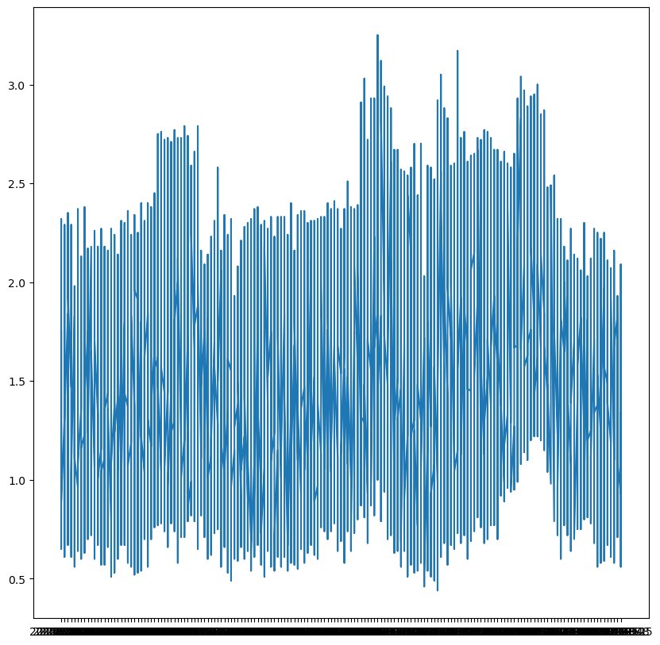
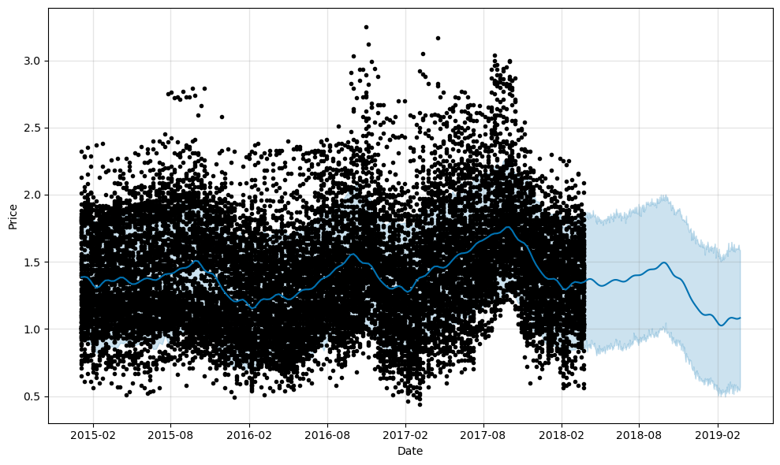
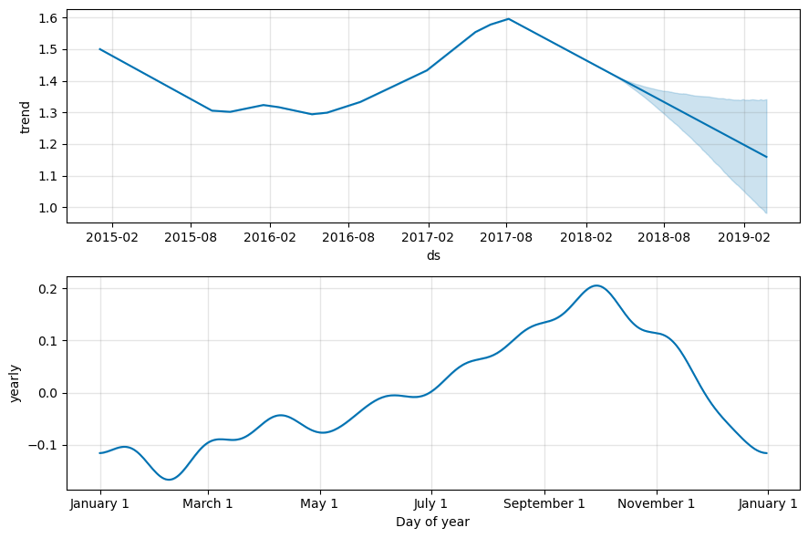
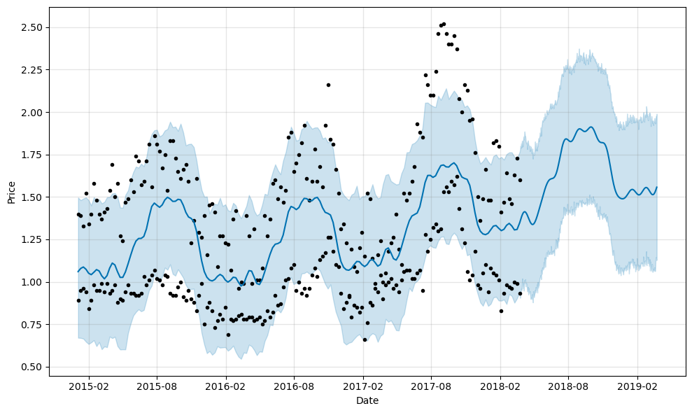
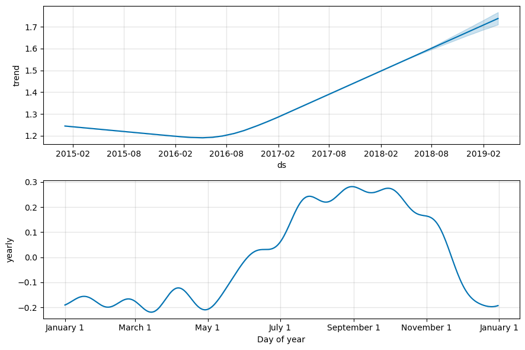

# Predicting Avocado Prices Using Facebook Prophet

A time series forecasting project that applies **Facebook Prophet** to the Hass Avocado Board retail dataset to predict future avocado prices nationally and at the regional level (West). The project covers exploratory analysis, data preparation, model fitting, 365-day forecasting, and seasonal decomposition.


---

## Table of Contents

- [Problem Statement](#problem-statement)
- [Dataset](#dataset)
- [Why Facebook Prophet?](#why-facebook-prophet)
- [Part 1: National Price Forecast](#part-1-national-price-forecast)
- [Part 2: West Region Forecast](#part-2-west-region-forecast)
- [Tech Stack](#tech-stack)
- [How to Run](#how-to-run)
- [Project Structure](#project-structure)
- [Key Takeaways](#key-takeaways)

---

## Problem Statement

Avocado prices are volatile and seasonally driven. This project uses historical weekly retail scan data from the Hass Avocado Board to:

- Understand national and regional price trends and seasonality
- Fit a time series model using Facebook Prophet
- Generate 365-day price forecasts at the national level and for the West region specifically
- Decompose forecasts into trend and seasonal components for interpretability

---

## Dataset

**Source:** [Hass Avocado Board](https://hassavocadoboard.com/) via Kaggle
**Coverage:** Weekly retail scan data, 2015-2018, 54 U.S. regions

Retail scan data comes directly from retailers' cash registers based on actual retail sales. The Average Price reflects a per-unit (per avocado) cost even when units are sold in bags. PLU codes apply to Hass avocados only -- other varieties such as greenskins are excluded.

| Column | Description |
|---|---|
| `Date` | Date of weekly observation |
| `AveragePrice` | Average retail price per avocado |
| `type` | Conventional or organic |
| `year` | Year of observation |
| `region` | U.S. city or regional aggregate |
| `Total Volume` | Total avocados sold that week |
| `4046` | Volume sold for PLU 4046 (small/medium Hass) |
| `4225` | Volume sold for PLU 4225 (large Hass) |
| `4770` | Volume sold for PLU 4770 (extra-large Hass) |

---

## Why Facebook Prophet?

Prophet is purpose-built for business time series with strong seasonal patterns. It models the series as:

```
y(t) = trend(t) + seasonality(t) + holidays(t) + error(t)
```

Three reasons it fits this problem well:
1. Avocado prices follow clear yearly and weekly cycles tied to harvest schedules and events like Super Bowl demand spikes
2. The dataset spans four years, giving Prophet enough signal to learn reliable seasonal patterns
3. Prophet handles missing data and outliers without manual imputation, and its component decomposition makes results directly interpretable

---

## Part 1: National Price Forecast

### Raw Price Time Series

All observations sorted chronologically and plotted to establish the baseline trend and volatility pattern across the full dataset.



---

### Data Distribution: Observations by Region

Count of weekly observations per U.S. region, confirming balanced coverage across markets.


---

### Data Distribution: Observations by Year

Yearly observation counts confirming consistent data coverage from 2015 through 2018.


---

### Prophet Forecast: National (365 Days)

The Prophet model was fit on `Date` (renamed to `ds`) and `AveragePrice` (renamed to `y`) across the full national dataset. A 365-day future dataframe was generated and the forecast was produced with upper and lower confidence intervals.



The dark line is `yhat` (predicted mean). The shaded band represents the uncertainty interval (`yhat_lower` to `yhat_upper`), which widens appropriately as the forecast extends further into the future.

---

### Prophet Components: National

The component decomposition breaks the forecast into its trend, weekly seasonality, and yearly seasonality signals.



- **Trend**: Shows the long-run direction of national avocado prices over the period
- **Weekly**: Captures within-week price variation across retail scan days
- **Yearly**: Reveals the seasonal cycle -- prices rise in winter/spring and soften in summer, consistent with harvest timing and consumer demand patterns (e.g., Super Bowl demand in February)

---

## Part 2: West Region Forecast

The same Prophet pipeline was re-run scoped to `region == 'West'` to capture regional price dynamics specific to West Coast markets.

### Raw Price Time Series: West Region


The West region shows a tighter price range and different amplitude in seasonal swings compared to the national aggregate, reflecting proximity to California and Mexico production regions.

---

### Prophet Forecast: West Region (365 Days)



---

### Prophet Components: West Region



The West region's component decomposition highlights differences in seasonal amplitude and trend slope compared to the national model, confirming that regional-level modeling adds meaningful precision beyond aggregate forecasts.

---

## Tech Stack


---

## How to Run

```bash
# 1. Clone the repo
git clone https://github.com/Agent007repo/-Avocado-Prices-Prediction.git
cd -- -Avocado-Prices-Prediction

# 2. Install dependencies
pip install prophet pandas numpy matplotlib seaborn jupyter

# 3. Download the dataset
# Get avocado.csv from: https://www.kaggle.com/datasets/neuromusic/avocado-prices
# Place it in the root directory

# 4. Run the notebook
jupyter notebook "Project 4 - Avocado Prices Prediction.ipynb"
```

> If Prophet installation fails, try: `conda install -c conda-forge prophet`

---

## Project Structure

```
-Avocado-Prices-Prediction/
├── Project 4 - Avocado Prices Prediction.ipynb   # Main notebook (code only, no outputs)
├── README.md                                      # This file
└── visualizations/
    ├── 00_cover_image.png
    ├── 01_national_price_timeseries.png
    ├── 02_regions_distribution.png
    ├── 03_year_distribution.png
    ├── 04_national_prophet_forecast.png
    ├── 05_national_prophet_components.png
    ├── 06_west_price_timeseries.png
    ├── 07_west_prophet_forecast.png
    └── 08_west_prophet_components.png
```

---

## Key Takeaways

- **Prophet captures seasonality cleanly** -- the yearly component confirms a consistent price cycle tied to harvest timing, with peaks in late winter/spring and troughs in summer
- **National vs. regional dynamics differ** -- the West region shows meaningfully different trend slope and seasonal amplitude, confirming that region-level modeling adds value beyond aggregate forecasts
- **Component decomposition is the real output** -- beyond point predictions, the trend and seasonality plots are what make Prophet valuable for business use cases: they explain *why* prices move, not just *what* they will be
- **Confidence intervals behave correctly** -- uncertainty expands as the forecast horizon extends, which is the statistically appropriate behavior for this type of additive model

---

## About Prophet

Prophet is open-source forecasting software released by Facebook's Core Data Science team.

- Paper: [Forecasting at Scale (Taylor and Letham, 2018)](https://peerj.com/preprints/3190/)
- Docs: [facebook.github.io/prophet](https://facebook.github.io/prophet/docs/quick_start.html)

---

## Author

**Samarth Annigeri**
Master of Management in Analytics, McGill University
[LinkedIn](https://www.linkedin.com/in/samarth-annigeri-14326a178/) | [Portfolio](https://theindianmagenta.notion.site/Product-Portfolio-f56b69796af74829a005df99d3cadf4b)
